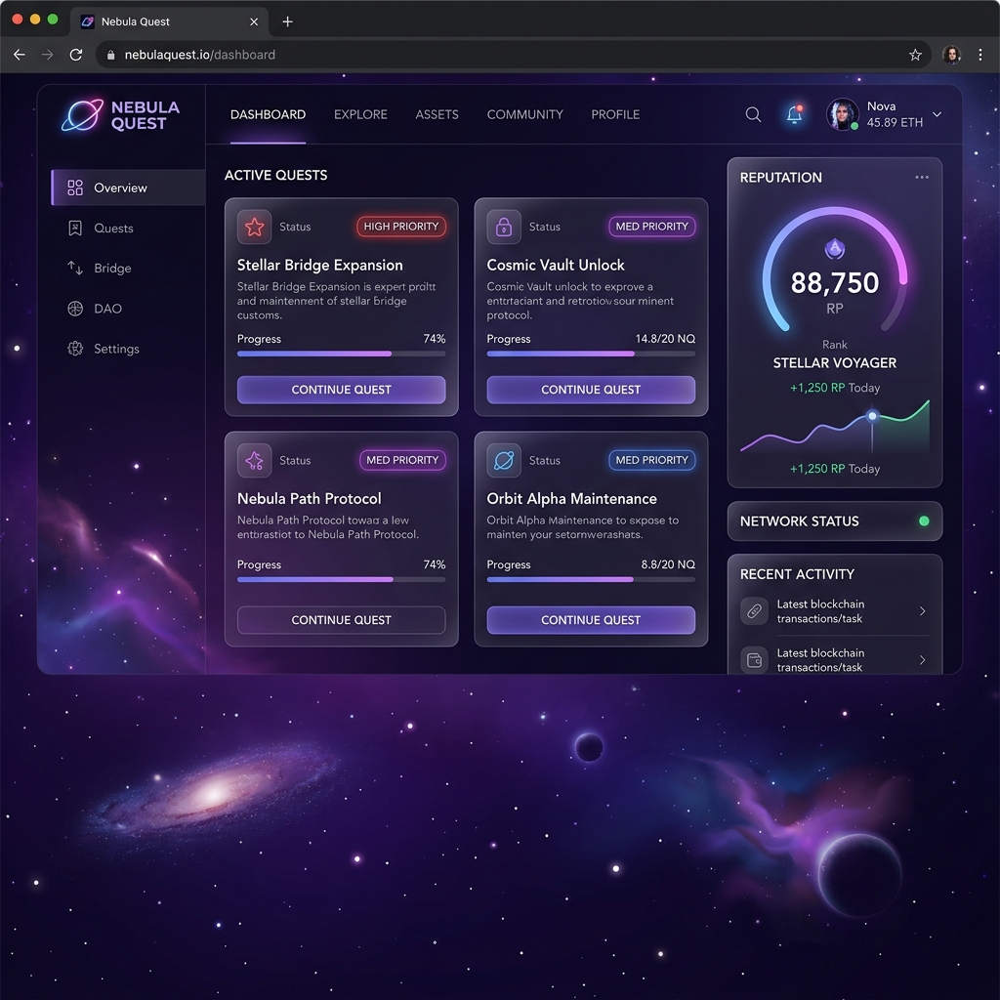

# Nebula Quest: Stellar Task Mastery

**Nebula Quest** is a gamified, decentralized task management system built on the **Stellar Blockchain** using the **Soroban Smart Contract SDK**. It transforms mundane productivity into a cosmic adventure where users can manage "Quests," track priorities, and build their on-chain "Reputation."

## 🌌 Project Vision

Nebula Quest aims to revolutionize personal accountability in the Web3 era by:
- **Ensuring True Ownership**: Your tasks and productivity data belong to you, protected by Stellar's cryptographic security.
- **On-Chain Reputation**: Every completed quest contributes to a permanent, verifiable reputation score on the blockchain.
- **Immutability & Transparency**: Prevent data loss or unauthorized modifications with a tamper-proof ledger.
- **High Performance**: Leveraging the lightning-fast speeds and near-zero fees of the Stellar network.

## 🚀 Key Features

### 1. **Secure Quest Management**
- Create, update, and delete quests with cryptographic proof.
- **Authentication**: All operations require `Address` authorization via `require_auth()`, ensuring only you can manage your data.
- **Scalability**: Built using Soroban's `Persistent` storage for efficient data handling.

### 2. **Gamified Productivity**
- **Priority Levels**: Categorize quests as High, Medium, or Low impact.
- **Status Lifecycle**: Track your journey from "Todo" to "In Progress" and finally "Completed."
- **Reputation System**: (Beta) Future updates will allow users to earn soul-bound tokens (SBTs) for completing high-priority quests.

### 3. **Premium User Interface**
- A stunning "Space/Cyberpunk" aesthetic with glassmorphism effects.
- Real-time dashboard with active quest counters and reputation tracking.
- Interactive animations for a smooth, high-end user experience.

### 4. **Stellar Integration**
- Native support for the Soroban Smart Contract SDK.
- Optimized for low-cost, high-speed execution on the Stellar network.

## 🛠️ Technical Details

- **Language**: Rust (Soroban SDK)
- **Frontend**: React + Vanilla CSS (Premium Nebula Design)
- **Blockchain**: Stellar (Soroban Testnet)
- **Smart Contract ID**: `CCV6I2Y7M... (NebulaQuestDeployer_Testnet)`
- **Latest Testnet Screenshot**:
  

## 📋 Smart Contract Functions

- `create_quest(owner: Address, title: String, desc: String, priority: Priority)` - Launch a new quest.
- `get_all_quests(owner: Address)` - Retrieve all quests associated with your space identity.
- `update_quest_status(owner: Address, quest_id: u64, status: Status)` - Progress or complete a quest.
- `delete_quest(owner: Address, quest_id: u64)` - Remove a quest from the active roster.

## 🚀 Getting Started

1. **Deploy**: The contract is pre-compiled for the Soroban environment.
2. **Connect**: Use a Stellar-compatible wallet (like Freighter) to connect to the dApp.
3. **Launch**: Start your first quest and begin building your cosmic reputation!

---

**Nebula Quest** - *Securing your productivity across the stars.*
